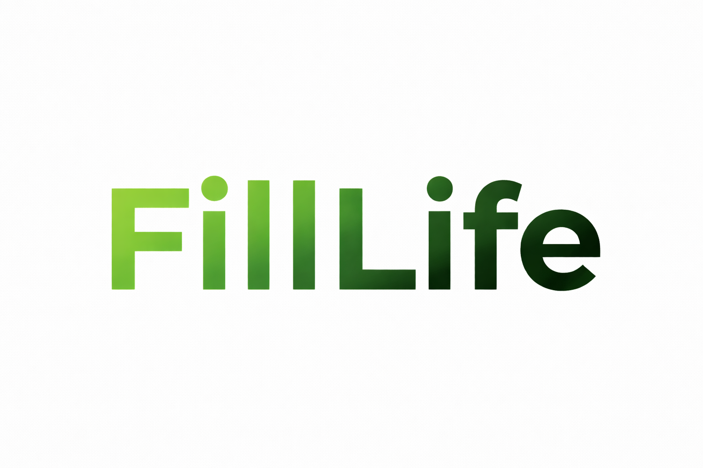
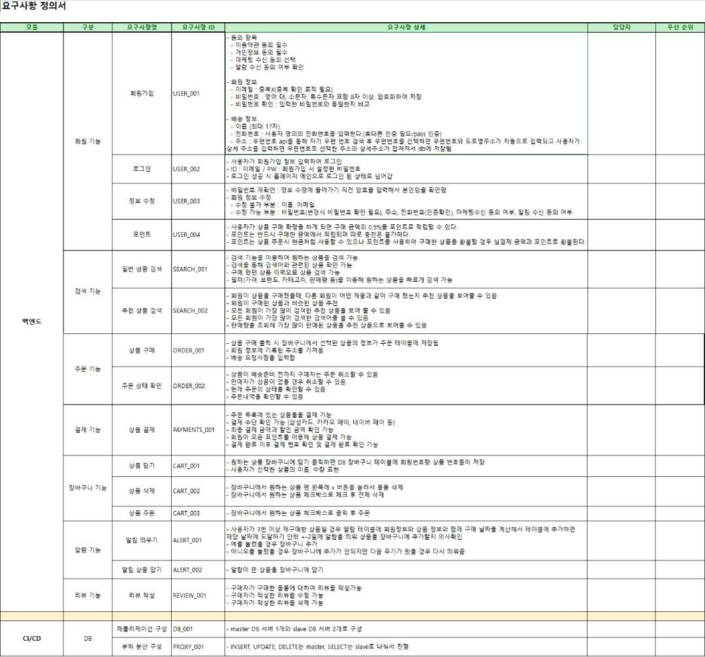
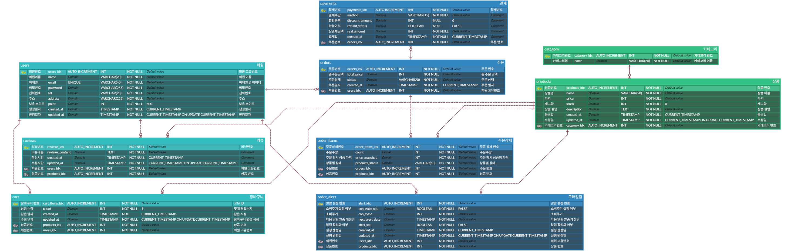

 

<h1 align="center" style="color: #61E786;">🛒 FillLife </h1> 

  

<h3 align="center">3팀 - Logos (Log-based Ordering System) </h3> 

## 🕵️ 팀원 소개

|  |  |  |  |
| :----------------------------------------------------------------------------------------------------------------------------------------------------------------: | :--------------------------------------------------------------------------------------------------------------------------------: | :-----------------------------------------------------------------------------------------------------------------------------------------------------: | :-----------------------------------------------------------------------------------------------------------------------------------------------------: | 
|                                                   ♠️ **김주형** [@Joohyeng](https://github.com/Joohyeng)                                                   |                                    ♥️ **이지희** [@dwg0245](https://github.com/dwg0245)                                    |                                           ♦️ **전민주** [@minju0077](https://github.com/minju0077)                                            |                                              ♣️ **정동현** [@DongHyunj](https://github.com/DongHyunj)                                               |

 

## 📅 프로젝트 기간

2025.12.29 ~ 2025.12.30
  

## 📌 프로젝트 소개
<blockquote> 
사용자 소비 패턴 분석 기반의 소진 주기 예측 및 장바구니 자동 완성 플랫폼
</blockquote>  

사용자의 쇼핑몰 행동 데이터(Log)와 구매 이력(Order)을 분석하여, 생필품이 떨어질 시점을 AI처럼 예측(Prediction)해 알림을 주고, 접속 시 구매할 확률이 높은 상품을 장바구니에 미리 담아주는(Auto-Completion) 초개인화 커머스이다.
  

## 📄 요구사항 정의서

<a href='./doc/FillLife 요구사항 정의서.pdf' alt="FillLife_system architecture"> 
 > 요구사항 정의서 </a>
  

## 🛠️ 기술 스택

### DBMS

 
 

### Infrastructure & Load Balancing
 
 

### 협업 & 기타

 

 

## 🚧 아키텍쳐 설계

 

  
레플리케이션을 선택한 이유

  

  <blockquote style="margin-left: 20px;">

본 프로젝트는 조회(Read) 트래픽이 80% 이상을 차지하는 이커머스 서비스의 특성과 대용량 데이터 분석에 따른 부하를 효율적으로 관리하기 위해 HAProxy 기반의 Master-Slave 레플리케이션 아키텍처를 구축했습니다. 쓰기(Write) 작업은 Master DB가, 대량의 조회와 ‘소비 패턴 분석’ 같은 무거운 쿼리는 HAProxy의 라운드 로빈 방식을 통해 Slave DB가 전담하도록 트래픽을 분리함으로써, 트랜잭션 잠금(Locking) 현상을 방지하고 일반 사용자의 구매 프로세스 속도를 쾌적하게 유지했습니다. 이를 통해 분석 쿼리와 트랜잭션을 효과적으로 격리했을 뿐만 아니라, 실시간 데이터 동기화를 통해 장애 발생 시에도 서비스를 지속할 수 있는 고가용성(High Availability) 환경을 확보했습니다.
  </blockquote>
   
  

 

## 🧩 ERD

 

## 🔎 프로젝트 기획 배경 
### 🔹 '경직된 구독'에서 '유연한 예측'으로  

  그동안 정기 배송(Subscription) 모델은 소비자의 편의를 돕는 혁신으로 여겨졌다. 그러나 '쿠팡'과 같은 즉시 배송이 보편화된 오늘날, 굳이 비축을 위해 미리 물건을 받아두는 경직된 정기 배송은 오히려 소비자에게 부담이 되고 있다. 내가 아직 샴푸를 다 쓰지 않았는데도 정해진 날짜에 물건이 배달되는 것은 더 이상 '혜택'이 아닌 '재고 관리의 스트레스'로 다가오기 때문이다.

  이러한 현상은 시장을 '경직된 구독'에서 '유연한 예측'으로 재편하고 있다.  KB금융지주 경영연구소의 보고서에 따르면, 현재 한국 쇼핑 구독 시장은 46%의 높은 침투율을 보이며 성숙기에 접어들었다. 그러나 시장 내부에서는 품목에 따라 수요의 극심한 양극화 현상이 나타나고 있다.

  식단 관리, 영양제, 전통주, 꽃 등 전문적인 큐레이션이 필요하거나 명확한 목적성을 가진 '버티컬 커머스' 영역에서는 정기배송 수요가 꾸준히 상승하고 있다. 이는 소비자들이 해당 분야에서 '전문가의 제안'과 '정기적인 즐거움'을 기대하기 때문이다.
  반면 소모품 및 공산품(Commodity)에 대한 정기배송 수요는 급격히 감소했다. 세제, 생수, 화장지 등 어디서나 쉽게 구할 수 있는 공산품은 로켓배송과 같은 즉시 배송 서비스가 보편화되면서, 굳이 한 달 뒤를 예측해 미리 묶여있을 필요가 없어졌다. 결과적으로 기존의 정기 배송은 소비자 개개인의 실제 소모 속도를 반영하지 못하는 한계만을 드러내며 '경직된 서비스'로 전락했다.

  또한 최근 소비자의 상품 구매 가치는 ‘가격 할인'에서 '초개인화 맞춤 케어'로 가치 중심이 이동했다. 이제 소비자들은 단순히 몇 퍼센트의 가격 할인을 받기 위해 집에 재고가 쌓이는 불편함을 감수하지 않는다. 자신의 실제 소비 주기에 맞춘 '초개인화된 관리'를 원하고 있으며, 이는 곧 데이터 기반의 예측 커머스가 공산품 시장의 새로운 돌파구가 되어야 함을 시사한다.

### 🔹 쇼핑은 '즐거움'인가, '피로한 노동'인가?  
  우리는 흔히 쇼핑을 즐거운 행위라고 생각하지만, 사실 생필품 구매 과정은 철저히 '피로한 노동'에 가깝다. 매번 똑같은 치약, 화장지, 생수를 검색하고, 장바구니에 담고, 결제하는 반복적인 여정은 현대인의 구매 여정에서 이탈을 유발하는 가장 큰 요인 중 하나다.

  이 지점에서 데이터 기반의 장바구니 자동 완성(Auto-Fill) 기술이 등장한다. 이는 소비자가 구매 의사를 결정하기 전, 과거의 구매 로그(Log)를 정밀하게 분석하여 "이때쯤이면 이 물건이 필요하시죠?"라며 미리 장바구니를 채워 두는 서비스다.

### 🔹 데이터가 제안하는 '완벽한 타이밍'  
  장바구니 자동 완성 서비스는 쇼핑의 단계를 획기적으로 줄여준다. 사용자가 앱을 켜는 순간, 시스템은 이미 사용자의 소비 패턴을 계산해 필요한 품목들을 리스트업해둔다. 소비자는 그저 확인 버튼만 누르면 된다.

  결국 미래의 쇼핑몰은 단순히 물건을 파는 곳이 아니라, 소비자의 시간과 노력을 아껴주는 '필수 생활 관리 서비스'로 안착하게 될 것이다. 데이터를 통해 사용자의 라이프사이클을 이해하고, 그들의 장바구니를 선제적으로 관리해 주는 것. 이것이 바로 우리가 지향해야 할 차세대 지능형 이커머스의 모습이다.

## 💡 부하테스트 전후 차이 

 

