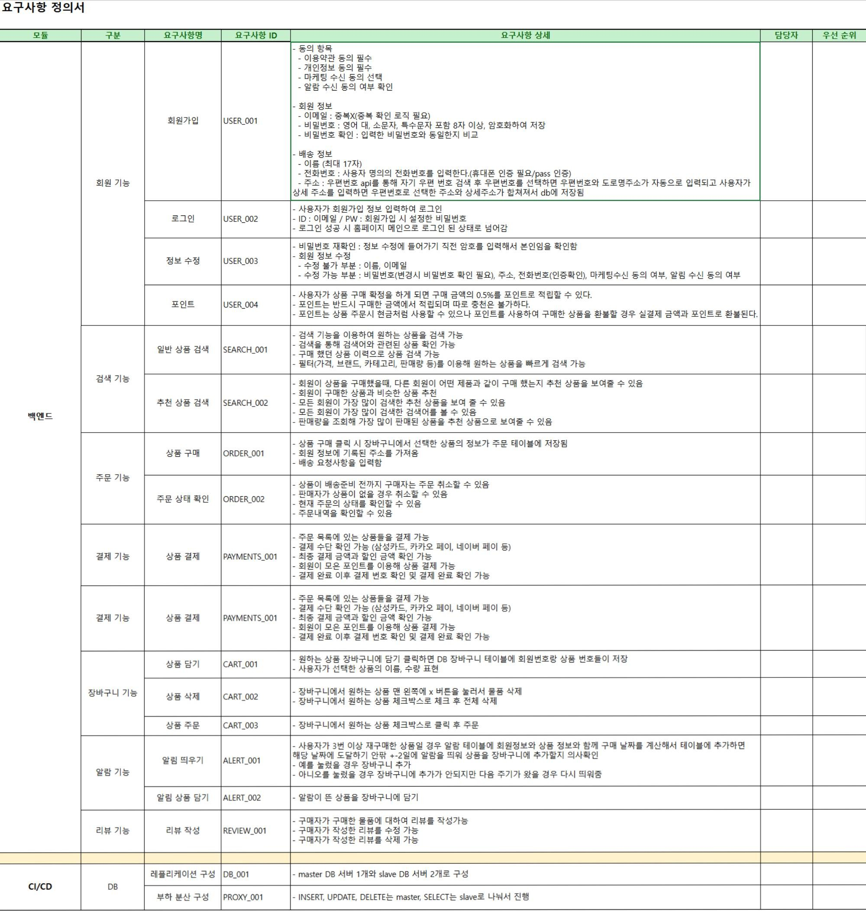
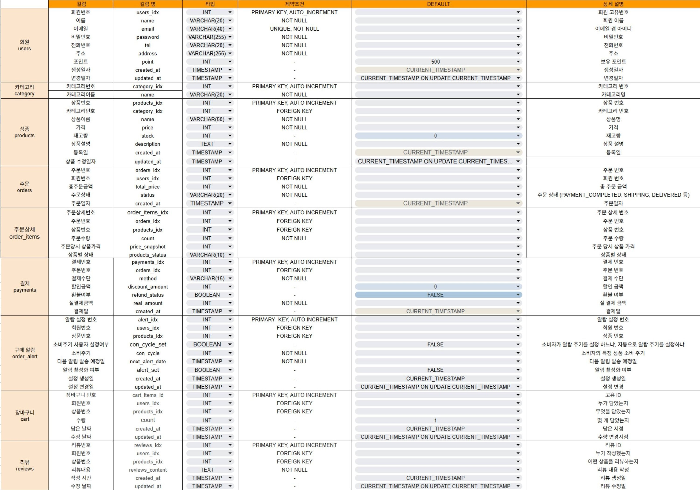
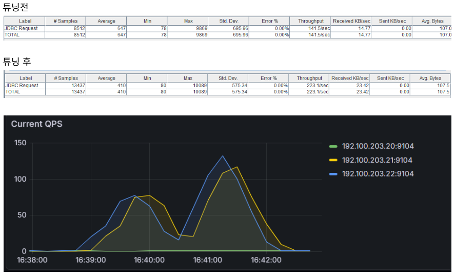
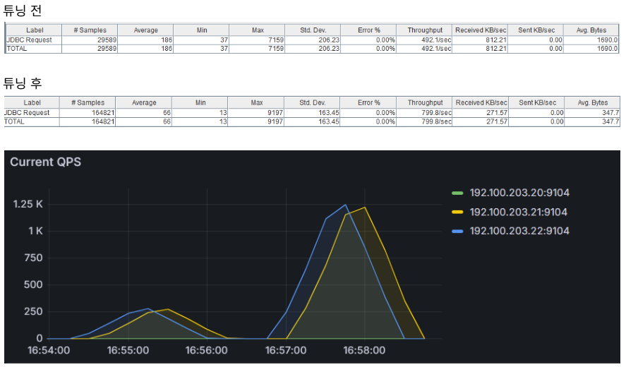

<br>

<h1 align="center" style="color: #94CE3A;">🛒 FillLife </h1><br>
<div align="center">
  
</div>
<h3 align="center">3팀 - Logos (Log-based Ordering System) </h3><br>

## 🕵️ 팀원 소개

<div align="center">

|  |  |  |  |
| :----------------------------------------------------------: | :---------------------------------------------------------: | :-----------------------------------------------------------: | :-----------------------------------------------------------: |
|  ♠️ **김주형**<br/>[@Joohyeng](https://github.com/Joohyeng)  |  ♥️ **이지희**<br/>[@dwg0245](https://github.com/dwg0245)   | ♦️ **전민주**<br/>[@minju0077](https://github.com/minju0077)  | ♣️ **정동현**<br/>[@DongHyunj](https://github.com/DongHyunj)  |

</div>
<br/>

## 📅 프로젝트 기간

2025.12.29 ~ 2025.12.30
<br/><br/>

## 📌 프로젝트 소개

사용자 소비 패턴 분석 기반의 소진 주기 예측 및 장바구니 자동 완성 플랫폼
<br/>

<blockquote> 
사용자의 쇼핑몰 행동 데이터(Log)와 구매 이력(Order)을 분석하여, 생필품이 떨어질 시점을 AI처럼 예측(Prediction)해 알림을 주고, 접속 시 구매할 확률이 높은 상품을 장바구니에 미리 담아주는(Auto-Completion) 초개인화 커머스이다.
</blockquote>
<br/><br/>

## 📄 요구사항 정의서

<a href='./doc/FillLife 요구사항 정의서.pdf' alt="FillLife_system architecture"> 
 > 요구사항 정의서 </a>
<br/><br/>

## 🛠️ 기술 스택

### DBMS


### Infrastructure & Load Balancing


### 협업 & 기타


<br/>

## 🚧 아키텍쳐 설계


<br/>
<details>
  <summary>레플리케이션을 선택한 이유</summary>
  <div markdown="1" style="margin-left: 20px;">

본 프로젝트는 조회(Read) 트래픽이 80% 이상을 차지하는 이커머스 서비스의 특성과 대용량 데이터 분석에 따른 부하를 효율적으로 관리하기 위해 Haproxy 기반의 Master-Slave 레플리케이션 아키텍처를 구축했습니다. 쓰기(Write) 작업은 Master DB가, 대량의 조회와 ‘소비 패턴 분석’ 같은 무거운 쿼리는 HAProxy의 라운드 로빈 방식을 통해 Slave DB가 전담하도록 트래픽을 분리함으로써, 트랜잭션 잠금(Locking) 현상을 방지하고 일반 사용자의 구매 프로세스 속도를 쾌적하게 유지했습니다. 이를 통해 분석 쿼리와 트랜잭션을 효과적으로 격리했을 뿐만 아니라, 실시간 데이터 동기화를 통해 장애 발생 시에도 서비스를 지속할 수 있는 고가용성(High Availability) 환경을 확보했습니다.

  </div>
</details>

<br/>

## 🧩 ERD


<br/>

## 🏗️ DB 테이블 설계도

<a href='./doc/FillLife 프로젝트 DB 설계도 - 테이블.pdf' alt="FillLife_system architecture"> 
 > DB 테이블 설계도 </a>
<br/>

<br/>

## 🔎 프로젝트 기획 배경

**1. 기존 서비스의 한계 (Pain Point)**
기존 정기 배송 서비스는 개인마다 다른 소비 속도를 반영하지 못해 상품이 쌓이거나 부족한 문제가 발생했습니다. 또한, 매번 반복되는 생필품 구매 과정은 사용자에게 불필요한 '쇼핑 노동'을 강요하고 있습니다.

**2. 해결 솔루션 (Solution)**
저희는 **사용자 행동 로그(Log) 기반의 소비 패턴 분석**을 통해 이 문제를 해결했습니다.

- **유연한 예측:** 정해진 날짜가 아닌, 데이터가 예측한 '실제 필요 시점'을 파악
- **장바구니 자동 완성:** 접속 시점에 필요한 물품을 미리 장바구니에 담아주는(Auto-Fill) 편의 제공

**3. 개발 목표**
단순한 판매를 넘어, 데이터를 통해 사용자의 라이프사이클을 관리하는 **'차세대 지능형 이커머스 플랫폼'** 구축을 목표로 합니다.

<br/>

## SQL 구문

- <a href='./doc/FileLife DB 생성 sql.txt' alt="DB 생성"> DB 생성 SQL </a>
- <a href='./doc/FillLife 기능 테스트 sql.txt' alt="기능 테스트"> 기능 테스트 SQL </a>
- <a href='./doc/SELECT 악성 sql.txt' alt="악성 SELECT sql"> INSERT 악성 SQL </a>
  <br/>

## 💡 부하테스트 전후 차이 비교

<a href='./doc/FillLife 부하 테스트 보고서.pdf' alt="부하 테스트 보고서" > > 부하 테스트 보고서 </a>

<hr/>

#### 🔹 Jmeter 기본 세팅 <br />


<br/>

#### 🔹 1. 내가 지난달에 산 금액 총 합계 <br />

```sql
SELECT
    u.name,
    COUNT(o.orders_idx) AS total_order_count,
    SUM(o.total_price) AS total_spent
FROM orders o
JOIN users u ON o.users_idx = u.users_idx
WHERE o.users_idx = FLOOR(1 + RAND() * 10000)
  AND o.created_at BETWEEN DATE_SUB(NOW(), INTERVAL 3 MONTH) AND NOW()
GROUP BY u.users_idx;
```

- 복합 인덱스 적용 `(users_idx, created_at)`: 테이블 풀 스캔(Full Scan)을 방지하고 인덱스 레인지 스캔 유도
- 컬럼 순서 최적화: 동등 조건(`=`)인 `users_idx`를 선행 컬럼으로, 범위 조건(`BETWEEN`)인 `created_at`을 후행으로 배치하여 인덱스 스캔 효율 극대화


<br/>
- 처리량(Throughput): 튜닝 전 대비 57.7% 급증 (141.5/sec → 223.1/sec) <br>
- 평균 응답 속도(Average Latency): 튜닝 전 대비 36.6% 단축 (647ms → 410ms) <br>
- 처리 용량: 동일 시간 내 처리한 샘플 수가 약 58% 증가 (8,512건 → 13,437건)

#### 🔹 2. 리뷰 내용 키워드 검색 <br />

**[AS-IS] 튜닝 전 (Full Table Scan 발생)**

```sql
SELECT
    u.name AS reviewer_name,
    p.name AS product_name,
    r.reviews_content,
    r.created_at
FROM reviews r
JOIN users u ON r.users_idx = u.users_idx
JOIN products p ON r.products_idx = p.products_idx
WHERE r.reviews_content LIKE '%배송%'
   OR r.reviews_content LIKE '%좋아요%'
ORDER BY r.created_at DESC
LIMIT 20;
```

- Full-Text Index (전문 검색) 적용: 기존 LIKE '%...%' 방식의 풀 테이블 스캔(Full Scan) 한계를 극복하기 위해 reviews_content에 n-gram 파서 기반의 Full-Text Index 생성 (Inverted Index 활용)
- 데이터 경량화 (Projection): 불필요한 전체 컬럼 조회(SELECT \*)를 지양하고, 화면에 필요한 컬럼만 지정하여 네트워크 패킷 사이즈 최적화

**[TO-BE] 튜닝 후 (Full-Text Index 적용)**

```sql
SELECT
    u.name AS reviewer_name,
    p.name AS product_name,
    r.reviews_content,
    r.created_at
FROM reviews r
JOIN users u ON r.users_idx = u.users_idx
JOIN products p ON r.products_idx = p.products_idx
WHERE MATCH(r.reviews_content) AGAINST('배송 좋아요' IN BOOLEAN MODE)
ORDER BY r.created_at DESC
LIMIT 20;
```


<br/>

- 처리량(Throughput): 튜닝 전 대비 62.5% 급증 (492.1/sec → 799.8/sec)<br>
- 평균 응답 속도: 튜닝 전 대비 64.5% 단축 (186ms → 66ms)<br>
- 데이터 효율: 요청당 평균 전송 바이트(Avg. Bytes)가 약 80% 감소 (1,690 → 347)
